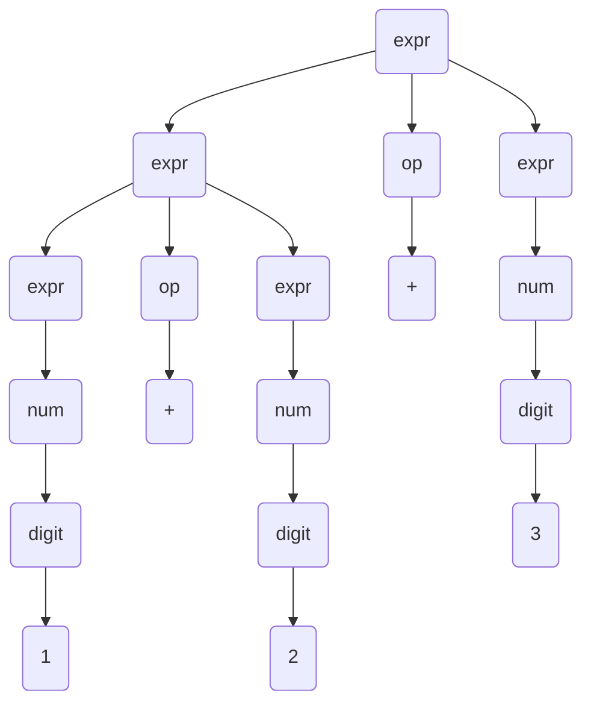
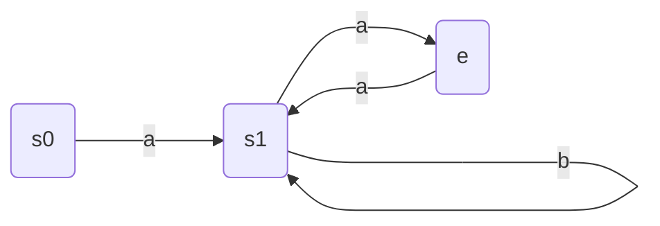

vikublöð - foxrritunarmál TÖL304G
---
**samansafn af glósum úr vikublöðum 1 - 14**

efni:
- [vika 1](#vika-1)
  - [mál](#mál)
  - [samhengisfrjáls mál og BNF](#samhengisfrjáls-mál-og-bnf)
  - [útleiðslur](#útleiðslur)
  - [regluleg mál](#regluleg-mál)
  - [reglulegar segðir](#reglulegar-segðir)
  - [endanlegar stöðuvélar](#endanlegar-stöðuvélar)

# vika 1
aðalega inngangur um námskeiðið og hvernig kennslu verður háttað en líka byrjað að fjalla um mál og ýmsar skilgreiningar á þeim

## mál
inngangur að málum, hvað þau eru og hvernig þau eru skilgreind, mikilvægt quote:  
> "Mál er einfaldlega mengi strengja. Strengur er endanleg runa tákna úr einhverjumengi, sem við þá köllum táknróf eða stafróf (alphabet) málsins"   

hinir kaflar viku 1 fara svo dýpra í efnið

## samhengisfrjáls mál og BNF
*BNF* er meta-mál eða nánar tiltekið aðferð til að skilgreina önnur mál, yfirleitt þegar talað er um BNF er verið a vísa í það sama og þegar talað er um *samhengisfrjálsar mállýsingar*  
dæmi um BNF skilgreining:  
```bnf
<expr>  ::= <num> | ( <expr> ) | <expr> <op> <expr>
<op>    ::= + | - | * | \
<num>   ::= <digit> <num> | <digit>
<digit> ::= 1 | 2 | 3 | 4 | 5 | 6 | 7 | 8 | 9 | 0
```
þessi BNF skilgreining lýsir einföldu máli sem inniheldur heiltölu reikniformúlur með einföldum aðgerðum

## útleiðslur
í flestum BNF skilgreiningum er yfirleitt hægt að leiða út ótakmarkaðan fjölda strengja, til dæmis mætti leiða út `1+1` og `1+1+1` og `1+1+...1` í BNF skilgreiningunni fyrir ofan  
það geta líka verið mismunandi leiðir til að leiða út sama strenginn og til að sjá þær leiðir er gott að nota útleiðslutré, tökum BNF fyrir ofan aftur sem dæmi og leiðum út strenginn `1+2+3`

> dem ok ég ætlaði að teikna upp aðra útleiðslu en þetta tók alltof langan tím, skítlookar samt  

eins og má sjá væri ekkert mál að svissa greinunum þannig að útleiðslan byrjaði á að finna bara `1` og endar á að finna `2+3`, það þarf að kunna að bæði skrifa svona tré upp og lesa úr því
> ~~svo veit ég ekki alveg afhverju maðurinn gerir það en hann nefnir EBNF og málrit strax hér í þessum kafla, en sýnir ekkert um þau eða hvað þau í raun eru~~  
> fór framúr sjálfum mér eins og svo oft áður :/


## regluleg mál
aðeins kynning á reglulegum málum, **ath. regluleg mál og reglulegar segðir eru ekki það sama þótt þau séu skyld**, regluleg mál eru undirflokkur samhengisfrjálsra mála, þe. <ins>öll regluleg mál eru samhengisfrjáls en ekki öll samhengisfrjáls mál eru regluleg</ins>  
til þess að lýsa og nota regluleg mál er ætlast til að kunnað sé á **reglulegar segðir** og **endanlegar stöðuvélar** *(finite state machines)*

## reglulegar segðir
úff gamli er bara með þurrustu og leiðinlegustu skilgreiningu á reglulegum segðum, og mér finnst þær meira að segja frekar skemmtilegar þannig það er að segja ehv  
í stuttu máli eru reglulegar segðir önnur leið til að lýsa reglulegum málum tökum sem dæmi mál þar sem stafrófið er `"A","B"`, öll `A` og `B` þurfa að vera í jafnvægi eins og svigar, fyrir hvert `A` sem opnast þarf að vera `B` sem lokar því
þá myndu eftirfarandi reglulegar segðir ganga upp
```regex
(AB|A(AB)*B)
# eða
(A(A(AB)*B)*B)*
```
en þessar sem koma núna ekki
```regex
(A*B*)
# eða
(A|B)*
```
auðvitið er svo hægt að finna fleiri reglulegar segðir sem uppfylla málið og ennþá fleiri sem gera það ekki en aðalatriðið er að geta horft á reglulega segð og gert sér grein fyrir því hvort hún eigi við mál eða ekki

> síða til að prófa sig áfram með regex: [regex101.com](https://regex101.com/r/2JtHKP/1)

## endanlegar stöðuvélar
endanlegar stöðuvélar eru enn ein leiðin til að skilgreina og lýsa reglulegum málum, tökum sem dæmi eftirfarandi stöðuvél yfir stafrófið `{a,b}`:  
