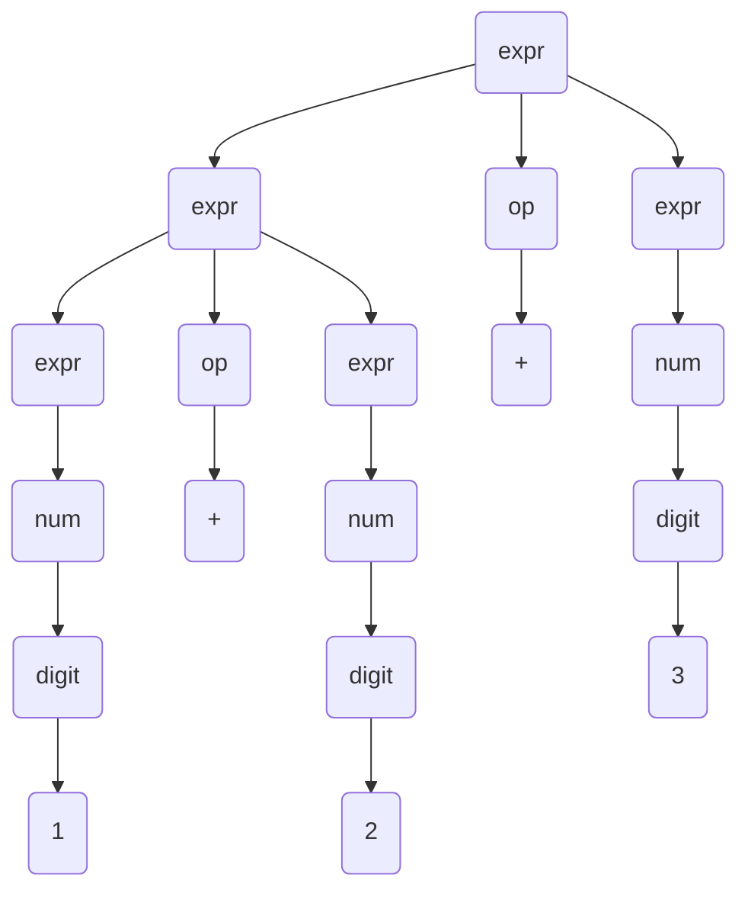
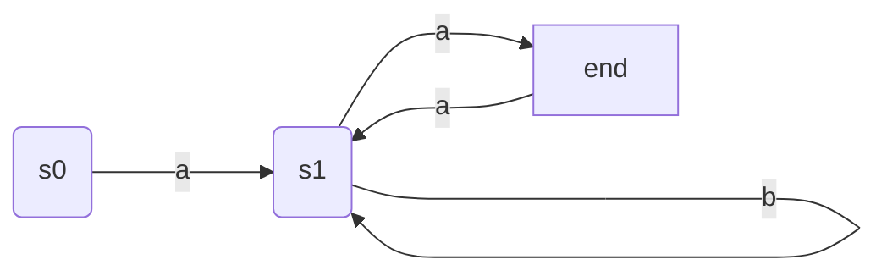

vikublöð - foxrritunarmál TÖL304G
---
**samansafn af glósum úr vikublöðum 1 - 14**

efni:
- [vika 1](#vika-1)
  - [mál](#mál)
  - [samhengisfrjáls mál og BNF](#samhengisfrjáls-mál-og-bnf)
  - [útleiðslur](#útleiðslur)
  - [regluleg mál](#regluleg-mál)
  - [reglulegar segðir](#reglulegar-segðir)
  - [endanlegar stöðuvélar](#endanlegar-stöðuvélar)
  - [EBNF](#ebnf)
- [vika 2](#vika-2)
  - [viðfangaflutningar](#viðfangaflutningar)
    - [gildisviðföng](#gildisviðföng)
    - [tilvísunarviðföng](#tilvísunarviðföng)
    - [afritsviðföng](#afritsviðföng)
    - [löt viðföng og nafnaviðföng](#löt-viðföng-og-nafnaviðföng)
  - [scheme](#scheme)
  - [endurkvæmni og halaendurkvæmni](#endurkvæmni-og-halaendurkvæmni)
- [vika 3](#vika-3)
  - [umdæmi](#umdæmi)
  - [lambda reikningur](#lambda-reikningur)
  - [bindingar, innsetning og reiknireglur](#bindingar-innsetning-og-reiknireglur)
- [vika 4](#vika-4)
  - [vakningarfærslur](#vakningarfærslur)
  - [lokanir](#lokanir)
  - [framhöld](#framhöld)
  - [straumar](#straumar)

# vika 1
aðalega inngangur um námskeiðið og hvernig kennslu verður háttað en líka byrjað að fjalla um mál og ýmsar skilgreiningar á þeim

## mál
inngangur að málum, hvað þau eru og hvernig þau eru skilgreind, mikilvægt quote:  
> "Mál er einfaldlega mengi strengja. Strengur er endanleg runa tákna úr einhverjumengi, sem við þá köllum táknróf eða stafróf (alphabet) málsins"   

hinir kaflar viku 1 fara svo dýpra í efnið

## samhengisfrjáls mál og BNF
*BNF* er meta-mál eða nánar tiltekið aðferð til að skilgreina önnur mál, yfirleitt þegar talað er um BNF er verið a vísa í það sama og þegar talað er um *samhengisfrjálsar mállýsingar*  
dæmi um BNF skilgreining:  
```bnf
<expr>  ::= <num> | ( <expr> ) | <expr> <op> <expr>
<op>    ::= + | - | * | \
<num>   ::= <digit> <num> | <digit>
<digit> ::= 1 | 2 | 3 | 4 | 5 | 6 | 7 | 8 | 9 | 0
```
þessi BNF skilgreining lýsir einföldu máli sem inniheldur heiltölu reikniformúlur með einföldum aðgerðum

## útleiðslur
í flestum BNF skilgreiningum er yfirleitt hægt að leiða út ótakmarkaðan fjölda strengja, til dæmis mætti leiða út `1+1` og `1+1+1` og `1+1+...1` í BNF skilgreiningunni fyrir ofan  
það geta líka verið mismunandi leiðir til að leiða út sama strenginn og til að sjá þær leiðir er gott að nota útleiðslutré, tökum BNF fyrir ofan aftur sem dæmi og leiðum út strenginn `1+2+3`

> dem ok ég ætlaði að teikna upp aðra útleiðslu en þetta tók alltof langan tím, skítlookar samt  

eins og má sjá væri ekkert mál að svissa greinunum þannig að útleiðslan byrjaði á að finna bara `1` og endar á að finna `2+3`, það þarf að kunna að bæði skrifa svona tré upp og lesa úr því
> ~~svo veit ég ekki alveg afhverju maðurinn gerir það en hann nefnir EBNF og málrit strax hér í þessum kafla, en sýnir ekkert um þau eða hvað þau í raun eru~~  
> fór framúr sjálfum mér eins og svo oft áður :/


## regluleg mál
aðeins kynning á reglulegum málum, **ath. regluleg mál og reglulegar segðir eru ekki það sama þótt þau séu skyld**, regluleg mál eru undirflokkur samhengisfrjálsra mála, þe. <ins>öll regluleg mál eru samhengisfrjáls en ekki öll samhengisfrjáls mál eru regluleg</ins>  
til þess að lýsa og nota regluleg mál er ætlast til að kunnað sé á **reglulegar segðir** og **endanlegar stöðuvélar** *(finite state machines)*

## reglulegar segðir
úff gamli er bara með þurrustu og leiðinlegustu skilgreiningu á reglulegum segðum, og mér finnst þær meira að segja frekar skemmtilegar þannig það er að segja ehv  
í stuttu máli eru reglulegar segðir önnur leið til að lýsa reglulegum málum tökum sem dæmi mál þar sem stafrófið er `"A","B"`, öll `A` og `B` þurfa að vera í jafnvægi eins og svigar, fyrir hvert `A` sem opnast þarf að vera `B` sem lokar því
þá myndu eftirfarandi reglulegar segðir ganga upp
```regex
(AB|A(AB)*B)
# eða
(A(A(AB)*B)*B)*
```
en þessar sem koma núna ekki
```regex
(A*B*)
# eða
(A|B)*
```
auðvitið er svo hægt að finna fleiri reglulegar segðir sem uppfylla málið og ennþá fleiri sem gera það ekki en aðalatriðið er að geta horft á reglulega segð og gert sér grein fyrir því hvort hún eigi við mál eða ekki

> síða til að prófa sig áfram með regex: [regex101.com](https://regex101.com/r/2JtHKP/1)

## endanlegar stöðuvélar
endanlegar stöðuvélar eru enn ein leiðin til að skilgreina og lýsa reglulegum málum, tökum sem dæmi eftirfarandi stöðuvél yfir stafrófið `{a,b}`:  

það er auðveldara, finnst mér, að hugsa í stöðuvélum frekar en að hugsa í reglulegum segðum og það má sjá hvort mál sé reglulegt eða ekki ef maður getur teiknað fyrir það stöðuvél, ekki hægt að teikna stöðuvél fyrir óreglulegt mál

## EBNF
extended BNF eða EBNF eins og það er betur þekkt er viðbót við BNF staðalinn, helstu breytingar eru meðal annars:
- slaufusvigar `{x}`
  - tákna 0 eða fleiri endurtekningar á x
- hornklofar `[x]`
  - tákna 0 eða 1 x
- svigar `(x|y)`
  - leyfir hópun EBFN strengurinn `(x|y),z` jafngildir BNF strengnum `x z | y z`

þess má geta að í EBNF er samskeyting táknuð með kommu `,` á móti BNF sem notar bil

# vika 2
í viku tvö er byrjað að fara í efni sem er síðan notað beint í skilaverkefnum þeirrar viku eins og endurkvæmni, halaendurkvæmni og kynningu á Scheme  
en fyrst var farið í viðfangaflutninga

## viðfangaflutningar
viðfangaflutningar eða *parameter passing* er regnhlífarhugtak yfir aðferðirnar fimm til að flytja viðföng til og frá, þær eru:
- gildisviðföng *(call by value)*
- tilvísunarviðföng *(call by reference)*
- afritsviðföng *(call by value-result)*
- nafnaviðföng *(call by name)*
- löt viðföng *(call by need, lazy evaluation)*

algengustu viðfangaflutningarnir eru **gildisviðföng**, notuð í **C**, **java**, **scheme** og **caml**, og þar á eftir **tilvísunarviðföng**, notuð ásamt gildisviðföngum í **pascal** og **c++**, en þrátt fyrir þau séu vinsælust eru hin líka notuð í einhverjum málum en það er ekki jafn algengt  

### gildisviðföng
þegar notast er við gildisviðföng er það gildað *(evaluated)* áður en það fer áfram inn í vakningarfærsluna sem til verður við kallið
> þetta hljómar flóknara en það er og útskýrist frekar ef skoðuð eru hinar aðferðirnar

### tilvísunarviðföng
tilvísunarviðföng eru pínu öðruvísi en gildisviðföng, þau eru mikið notuð í **Rust** og **C++**, þau eru ekki gilduð áður en þau eru sett inn í vakningarfærslu heldur er frekar sett vistfang breytunar, þetta getur ruglað fólk í ríminu en sjáið kóðabút:  
```rust
fn main() {
    let mut s = String::from("hello");

    println!("{}",s);
    change(&mut s);
    println!("{}",s);
}

fn change(some_string: &mut String) {
    some_string.push_str(", world");
}
```
<details>
  <summary style="font-weight: bold; cursor: pointer;">útkoma</summary>
  <pre>
  hello
  hello, world</pre>
</details>

hérna eru við að kalla á `change` fallið með tilvísunarviðfanginu `&mut s` og þá er hægt að sjá á útkomunni að `change`, þrátt fyrir að vera breyta gildinu inn í fallinu, hefur áhrif á `s` í main fallinu  
þetta er vegna þess að `change` var ekki að bæta við gildið `s` heldur var það að bæta við gildið sem er staðsett í minnisvæðinu fyrir `s`

### afritsviðföng
afritsviðföng eru eins og litli ljóti bróðir tilvísunarviðfanga, á yfirborðinu virðast þau haga sér eins en það er einhver munur þarna ofan í grugguga vatninu  
afritsviðföng, eins og tilvísunarviðföng, geta haft áhrif á breytur utan falls en samt ekki beint, þegar kallað er á fall með afritsviðfangi er gildi þess afritað og sent inn í vakningarfærslu fallsins, svo þegar keyrslu líkur á fallinu er núverandi gildi viðfangsins afritað aftur til baka inn í upprunalegu breytuna

### löt viðföng og nafnaviðföng
nafnaviðföng eru þannig að þau eru ekki reiknuð nema þegar verið er að nota þau í fallinu þar sem þau eru viðfang, löt viðföng eru voða svipuð nema hvað að þau eru **aðeins** reiknuð í **fyrsta** skipti sem þau eru notuð

## scheme
við elskum scheme það er svo gott með alla sína sviga, endurkvæmni og hala  
helstu hlutir til að muna þegar verið er að vinna í scheme, kallað er á öll föll á sama hátt sama hvort þau séu einundar- eða tvíundarföll: opna sviga, nafn falls, viðföng, loka sviga  
annars eru fullt af dæmum úr áfanganum til að æfa sig á, ætla setja eitt flott hér:  

```scheme
;; Notkun:  (reviota n)
;; Fyrir:   n er heiltala stærri eða jöfn og 0, n >= 0
;; Gildi:   listi af með stökum (n (n-1) ... 2 1), 
;;          skilar tóma lista ef n er 0
(define (reviota n)
    ;; Notkun:  (inner arr i)
    ;; Fyrir:   arr, listi af heiltölum í minnkandi röð
    ;;          i, heiltala stærri en 1, i > 1
    (define (inner arr i)
        (if (= i n)
            (cons i arr)
            (inner (cons i arr) (+ i 1))
        )
    )
    (if (= n 0)
        '()
        (inner '() 1)
    )
)
(reviota 0)
(reviota 1)
(reviota 10)
```
<details>
  <summary style="font-weight: bold; cursor: pointer;">útkoma</summary>
  <pre>
  '()
  '(1)
  '(10 9 8 7 6 5 4 3 2 1)</pre>
</details>

## endurkvæmni og halaendurkvæmni
við vitum flest hvað endurkvæmni er, fall sem kallar á sjálft sig eða önnur föll sem kalla síðan aftur á það og vinnur sig aftur til baka þegar það er komið með niðurstöðu, halaendurkvæmni er meira kúl   
halaendurkvæmt fall er skilgreint sem **endurkvæmt fall sem endar á því að kalla á sjálft sig**  
> ég hef aldrei verið mjög hrifinn af þessari skilgreiningu og finnst þægilegra að hugsa um halaendurkvæm föll sem endurkvæm föll sem halda utan um gögnin sem þau eru að vinna með, í gegnum alla keyrslu

þannig ef það þyrfti að reikna summu frá 1 upp í n með endurkvæmni myndi fallið taka eitt viðfang `n` og kalla á `n+` fallið sjálft með `n-1` þangað til `n==1` og svo vinna sig til baka með tölurnar sem komu út  
halaendurkvæmt fall myndi einfaldlega halda utan um summuna ásamt því að kalla á sig sjálft aftur, það sleppur þá við að vinna sig til baka sem sparar slatta af tíma 

# vika 3
vikan fjallar um bindingar og sýnileika í bálkamótuðum forritunarmálum
> settu byssu við höfuðið á mér og ég gæti ekki sagt þetta á ensku Snorri og Ebba got me wildin

förum yfir nokkur lykilatriði í sambandi við bindingu og sýnileika:
- skilgreining nafna
- umdæmi skilgreiningar *(scope)*
- földun *(nesting)*
- földunarhæð *(nesting level)*
- frjálsar breytur *(free variables)*
- bundnar breytur *(bound variables)*

binding nafna er málefni sem þýðendur og notendur mála þurfa að vera sammála um, þessvegna er mikilvægt að skilja vel umdæmi eða scope nafna

## umdæmi
umdæmi eða scope segir til um hvaða breytur hafa gildi og hvar, þegar það er kallað á fall, getur það fall náð í gildi úr breytu utan síns umdæmi, í sumum málum já, í flestum málum nei, skoðum smá scheme forritsbút:  
```scheme
(define (A ...) ...
  (define (B ...) ...
    (define (C ...) ...
      (define (D ...) ...
      )
    )
  )

  (define (E ...) ...
  )
)
```
þetta er klassískt prófadæmi, spurt er fyrir hvert fall, segið hvaða staðværar breytur fallið getur kallað á og hvaða föll geta kallað á fallið, tafla:

| hægt að kalla á _ úr | A | B | C | D | E |
|---|---|---|---|---|---|
| A | X | X | X | X | X |
| B | X | X | X | X | X |
| C |   | X | X | X |   |
| D |   |   | X | X |   |
| E | X | X | X | X | X |

| geta notað staðværar breytur _ | A | B | C | D | E |
|---|---|---|---|---|---|
| A | X | X | X | X | X |
| B |   | X | X | X |   |
| C |   |   | X | X |   |
| D |   |   |   | X |   |
| E |   |   |   |   | X |

í stuttu máli er bara hægt að kalla á sjálfan sig, foreldra og systkini foreldra og bara hægt að nálgast staðværar breytur sjálfs síns og foreldra  

> hélt hann myndi tala ehv meira um þetta en i guess not

## lambda reikningur
lambda reikningur er týpa af reikningi þar sem notast er við föll sem bæði inntak og úttak, held ég, það er ekki akademíska skilgreiningin en ég er heldur ekki prófessor  
lambda föll eru mikið notuð í tölvunarfræði og umdæmi þeirra eru pínu skrítin þannig ég fer ekki dýpra í það :imp:
dæmi um lambda reikning í scheme:
```scheme
(+ ((lambda (x) (* x x) 10 10)) 5)
```
ég veit ekki, þetta er ekkert rosa gott dæmi datt ekkert í hug :artist:  
eða jú, þegar verið er að vinna með listavinnslu er mikið notað map föll, notum javascript bút til dæmis, ég ætla byrja með lista af tölum og ýtra yfir þær og margfalda með indexinu:  
```js
let arr = [1,2,3];
let out = arr.map((val, ind) => {return val*ind})
// nú er gildi á out [0, 2, 6]
```
> ég er virkilega bara farinn að skrifa ehv bull, vonandi hjálpar þetta einhverjum, sérstaklega mér :nerd_face:

<details>
  <summary style="font-weight: bold; cursor: pointer;">set skilgreininguna hér en þú þarft að velja að lesa hana</summary>
  <ul>
  <li>Ef x er breytunafn þá er x lögleg λ-formúla.</li>
  <li>Ef x er breytunafn og N er lögleg λ-formúla þá er λx.N lögleg λ-formúla.</li>
  <li>Ef M og N eru löglegar λ-formúlur þá er M N lögleg λ-formúla.</li>
  <li>Ef M er lögleg λ-formúla þá er (M ) lögleg λ-formúla.</li>
  <li>Engar aðrar formúlur eru löglegar λ-formúlur</li>
  </ul>
</details>

## bindingar, innsetning og reiknireglur
> kominn í efnið sem ég kann ekki 😃 😃 hmmm kannski ég læri ehv núna 
> nei held nú síður ekki séns að þetta sé að koma á prófinu þannig so sorry 😎

# vika 4
það eru þau þrjú stóru í þessum kafla, ef þú lest ehv hérna þá ætti það að vera efnið úr þessari viku, vona að ég geti gert þetta almennilega  
þrjú stóru eru **vakningarfærslur** (*activation records*), **lokanir** (*closures*) og straumar  
það er líka talað um **framhöld** (*continuations*) en ég veit ekki hvað það er svo við lærum saman :boxing_glove:

## vakningarfærslur
vakningarfærsla er það minnissvæði sem fall tekur frá og notar á meðan keyrslu stendur, þær eru betur þekktar sem **activation records** eða jafnvel **stack frames**, það er að segja í málum sem geyma vakningarfærslu á hlaða (*stack*), flest mál gera það en ekki öll  
það sem vakningarfærslur innihalda er <ins>***mjög***</ins> mikilvægt að læra / muna 🙆‍♂️  
<details>
  <summary style="font-weight: bold; cursor: pointer;">vakningarfærslur innihalda...</summary>
  <ul>
  <li>viðföng fallsins (arguments)</li>
  <li>staðværar breytur fallsins (local variables)</li>
  <li>vendisvistfang (return address)</li>
  <li>stýrihlekk (access link, dynamic link)</li>
  <li>tengi- / aðgangshlekk (access link / static link)</li>
  </ul>
</details>

ef vakningarfærslur eru geymdar á hlaða, lang oftast, þá bendir stýrihlekkur alltaf á næstu vakningarfærslu í hlaðanum

## lokanir
lokun (closure) er gildi sem er notað í bálkmótuðum forritunarmálum eins og fallsbendar eru notaðir í málum eins og `C` eða `C++`

það er líka mikilvægt að vita hvað lokanir innihalda, það er major prófsspurning, en ef þú veist vel hvað er í vakningarfærslum þá veistu næstum allt sem er í lokunum líka því lokanir innihalda bara tvo hluti
- fallsbendi
  - bendir á viðeigandi vélarmálsþulu falls
  > veit ekki alveg hvað það er en skiptir ekki öllu því ég veit að það er til staðar
- aðgangshlekk á viðeigandi foreldrafall
  - það þýðir að lokun innihleldur allar staværar breytur fallsins sem inniheldur fallið sem verið er að vinna með, nema stýrihlekkinn af ehv ástæðum

þá er actually kominn skýring á dæminu sem ég setti upp í [umdæmis kaflanum](#umdæmi) það átti kannski meira við hérna en who cares 🤷

<details>
  <summary style="font-weight: bold; cursor: pointer;">lokanir innihalda...</summary>
  <ul>
  <li>fallsbendi (function pointer)</li>
  <li>aðganshlekk (access link)</li>
  <li>viðföng fallsins (arguments)</li>
  <li>staðværar breytur fallsins (local variables)</li>
  <li>vendisvistfang (return address)</li>
  </ul>
</details>

## framhöld
framhöld (*continuation*) er ehv sem ég ætla ekki að tala um 👍

## straumar
straumar eru "*óendanlegir*" listar, þeas gögn sem verða til yfir tíma  
scheme getur unnið með strauma og gerir það býsna vel bara, það eru þá sérstök föll sem notuð eru til að vinna úr listunum, þau eru yfirleitt mjög svipuð og venjuleg föll nema hvað þau bæta `stream` ehvstaðar inn í nafnið, dæmi um slík, mjög hentug, föll eru:
- `cons-stream`
- `stream-cdr`
- `stream-car`